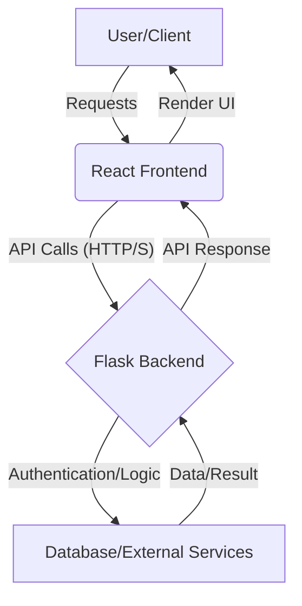

<div align="center">

# Anisha: Secure & Scalable Full-Stack Application
### _Empowering modern web experiences with robust backend services and a dynamic frontend._


[Features](#features) • [Installation](#installation) • [Usage](#usage) • [Architecture](#architecture)

</div>

---

### 🌟 The Value Proposition

*   **🚀 Rapid Development**: Leverage modern frameworks (Flask, React, Vite) for agile and efficient application delivery.
*   **🔒 Enhanced Security**: Built with a focus on authentication and secure backend interactions, protecting your data and users.
*   **🌐 Modular & Scalable**: Designed for clear separation of concerns, ensuring maintainability and future expansion across both frontend and backend.

**Quick-Start**:
Ready to dive in? Get Anisha up and running with a single command:

```bash
git clone https://github.com/your-username/anisha.git && cd anisha && npm install && npm run dev:all
```
_Note: `npm run dev:all` is a conceptual command. Refer to [Installation](#installation) for detailed setup._

---

### 🏛️ Architecture Overview

The Anisha project adopts a **Client-Server architecture**, separating the user interface (React) from the data processing and business logic (Flask). Communication between these layers is facilitated through a **RESTful API**, ensuring stateless and efficient data exchange.



#### Architectural Patterns

| Pattern                  | Description                                                | Application in Anisha                                                    |
| :----------------------- | :--------------------------------------------------------- | :----------------------------------------------------------------------- |
| **Client-Server**        | Separation of UI (client) from business logic (server).    | React serves as the client, Flask as the server providing APIs.          |
| **RESTful API**          | Standardized, stateless communication protocol.            | Flask backend exposes REST endpoints for frontend interaction.           |
| **Virtual Environments** | Isolated Python environments for dependency management.    | `flask-auth` uses `pyvenv.cfg` for dedicated backend dependencies.       |
| **Modular Design**       | Breaking down functionality into interchangeable modules.  | Frontend (React components/pages) and Backend (routes/services/models).  |
| **Component-Based UI**   | Building user interfaces with reusable, encapsulated components. | React.js promotes this structure for UI development.                    |

---

### 📂 Project Structure

```
anisha/
├── .gitignore
├── README.md                   # Project documentation (this file)
├── LICENSE
├── backend/                    # Backend services built with Flask
│   └── flask-auth/             # Flask application for authentication
│       ├── app.py              # Main Flask application entry point
│       ├── config.py           # Application configuration settings
│       ├── routes/             # Defines API endpoints (e.g., /api/auth)
│       ├── models/             # Database schema and data models (e.g., User)
│       ├── services/           # Business logic and service layer
│       ├── templates/          # Jinja2 templates (if any server-side rendering)
│       ├── static/             # Static assets served by Flask
│       ├── requirements.txt    # Python dependencies for the backend
│       └── pyvenv.cfg          # Python virtual environment configuration
├── frontend/                   # Frontend application built with React & Vite
│   └── GDG/                    # Root directory for the React/Vite project
│       ├── public/             # Public assets (e.g., index.html, favicon)
│       ├── src/                # React source code
│       │   ├── assets/         # Images, fonts, etc.
│       │   ├── components/     # Reusable UI components
│       │   ├── pages/          # Application views/screens
│       │   ├── App.jsx         # Main React application component
│       │   └── main.jsx        # React application entry point
│       ├── vite.config.js      # Vite build configuration
│       ├── eslint.config.js    # ESLint configuration for code quality
│       ├── package.json        # Node.js dependencies for the frontend
│       ├── package-lock.json   # Exact dependency versions
│       └── index.html          # Main HTML file for the frontend
└── tools/                      # Optional: Scripts for deployment, testing, etc.
    └── start.sh                # Conceptual script for unified local startup
```

---

### 🛠️ Setup & Usage

To get Anisha running on your local machine, follow these steps:

#### 1. Prerequisites

Ensure you have the following installed:

| Tool     | Purpose                          | Version     |
| :------- | :------------------------------- | :---------- |
| **Git**  | Version control                  | `>=2.x`     |
| **Python** | Backend runtime                  | `>=3.8`     |
| **pip**  | Python package installer         | `>=20.x`    |
| **Node.js**| Frontend runtime & build tools   | `>=18`      |
| **npm**  | Node.js package manager          | `>=8.x`     |

#### 2. Installation

1.  **Clone the Repository**:
    ```bash
    git clone https://github.com/your-username/anisha.git
    cd anisha
    ```

2.  **Backend Setup (Flask - `backend/flask-auth`)**:
    ```bash
    cd backend/flask-auth
    python -m venv venv                # Create a Python virtual environment
    source venv/bin/activate           # Activate the environment (Linux/macOS)
    # venv\Scripts\activate           # Activate the environment (Windows)
    pip install -r requirements.txt    # Install Python dependencies
    ```

3.  **Frontend Setup (React/Vite - `frontend/GDG`)**:
    ```bash
    cd ../../frontend/GDG
    npm install                        # Install Node.js dependencies
    ```

#### 3. Configuration

Anisha utilizes environment variables for sensitive data and dynamic settings. Create `.env` files in `backend/flask-auth` and `frontend/GDG` as needed.

| Variable           | Location     | Description                                                     | Example                                           |
| :----------------- | :----------- | :-------------------------------------------------------------- | :------------------------------------------------ |
| `FLASK_APP`        | `backend/flask-auth` | Specifies the Flask application entry point.                    | `app.py`                                          |
| `FLASK_ENV`        | `backend/flask-auth` | Sets the Flask environment mode (development, production).      | `development`                                     |
| `SECRET_KEY`       | `backend/flask-auth` | A secret key for session management and security.               | `supersecretkey`                                  |
| `DATABASE_URL`     | `backend/flask-auth` | Connection string for your database.                            | `sqlite:///site.db` or `postgresql://user:pw@host/db` |
| `VITE_API_BASE_URL`| `frontend/GDG` | Base URL for the backend API calls from the frontend.           | `http://localhost:5000/api`                       |

#### 4. Running the Application

1.  **Start the Flask Backend**:
    From `anisha/backend/flask-auth`, with the virtual environment activated:
    ```bash
    flask run
    # Expected output: Running on http://127.0.0.1:5000 (Press CTRL+C to quit)
    ```

2.  **Start the React Frontend**:
    From `anisha/frontend/GDG`:
    ```bash
    npm run dev
    # Expected output: Local:    http://127.0.0.1:5173/
    ```

3.  Access the application in your browser: `http://127.0.0.1:5173/`

---

### 🗺️ Roadmap

Anisha is continuously evolving. Here are some planned enhancements:

- [ ] Implement user registration and login functionalities.
- [ ] Integrate a PostgreSQL database for robust data persistence.
- [ ] Develop comprehensive unit and integration tests for both frontend and backend.
- [ ] Enhance UI/UX with modern design principles and responsive layouts.
- [ ] Implement Dockerization for easier deployment and environment consistency.
- [ ] Set up CI/CD pipelines for automated testing and deployment.
- [ ] Explore GraphQL for more efficient data fetching.
- [ ] Add real-time communication capabilities using WebSockets.